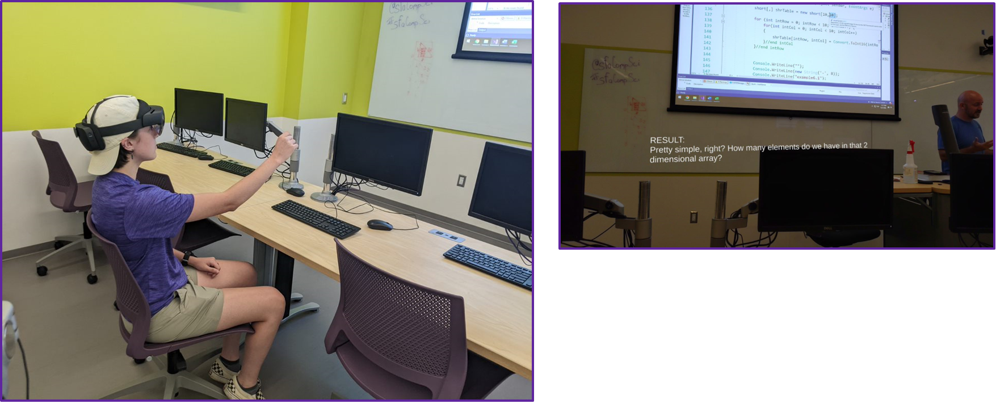

# MRS

Recent data from the US Census indicates that roughly 1 in 5 Americans are disabled. Also, many Americans will be subject to a situational disability at some point in their lives. This can include any number of situations such as breaking a bone, dilating pupils, etc. 

The overarching goal of this project is to combine two emerging technologies (Mixed Reality and Natural Language Processing) to improve the everyday experience for individuals that are hearing impaired. Mixed reality refers to the merging of the real world with digital elements. Here virtual elements are overlayed in the physical world to create an immersive experience. Natural Language Processing (NLP) refers to the ability of computer programs to interpret human language as it is spoken (or written). It is a component of Artificial Intelligence that has made tremendous leaps over the past decade, mainly due to the field’s intersection with the ever-expanding discipline of data science. In fact, NLP has become an integral part of everyday life with the increased use of voice assistants such as Amazon’s Alexa and Apple’s Siri.

The theory guiding this research is that these technologies (AI and Mixed Reality) will become an essential part of our everyday lives and be instrumental in assisting disabled individuals. This project combines these two distinct technologies to create a real-time mixed-reality subtitle system. The software is implemented on a Microsoft HoloLens 2 wearable device. The resulting system allows users to stay fully immersed in their environment while simultaneously having subtitles appear virtually in front of them in real-time. The system provides closed captioning for everyday life and gives hearing-impaired individuals the ability to interact seamlessly with others. 

To achieve the project objectives, we used developed software to connect the Azure speech-to-text API to the Microsoft Mixed Reality Toolkit. This was accomplished using the C# programming language and the Unity development platform. The prototype has been tested in a classroom environment with a live lecture. After development and initial testing, the system customization features were added  1) the user can store captions in a text document after each session 2) the user can use a "time stamp" option during the session to highlight that text in the text document to refer to later 3) user can change the native language. This essentially also gives the system the ability to serve as a translation device. 

History has shown that the long-term impacts of projects geared toward accessibility tend to be tremendous. This is often because technologies designed to assist the disabled in society turn out to be extremely useful to everyone. Examples such as audiobooks, movie subtitles (closed captions), electric toothbrushes, and curb cuts are enjoyed by numerous individuals. Thinking locally, the research project may serve as a prototype that SFA’s disability services could make use of to enhance the educational experience of students with hearing disabilities. 
